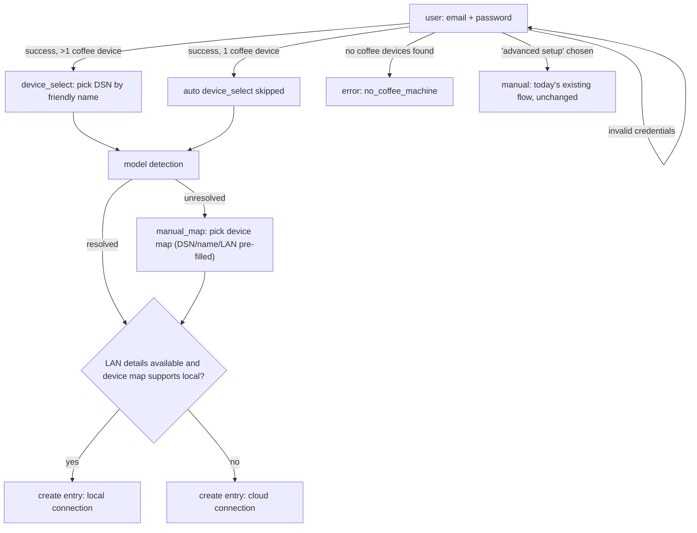

# Contract: `cremalink_ha` Config-Flow Steps (User-Facing)

This documents the step sequence and data contract the config flow
presents to users — the "UI contract" for this feature. Step ids in
`` `code` `` match the planned `async_step_*` method names.

## New primary path (cloud-assisted)

### `async_step_user` (was: device-map picker; now: cloud login)

- **Input schema**: `email` (str, required), `password` (str, required).
  Region is fixed to `"EU"` for v1 — no field shown (Research #1).
- **On submit**: calls `authenticate_cloud()` then
  `Client.list_account_devices()` (both via executor job).
- **Errors**: `auth_failed` (invalid credentials), `no_coffee_machine`
  (account has devices but none classify as coffee machines), `no_devices`
  (account has zero devices).
- **Additional action**: an "advanced setup" link/menu option that routes to
  `async_step_manual` instead of submitting login.

### `async_step_manual` (renamed from today's `async_step_user`)

- Unchanged behavior: today's device-map picker → local/cloud choice →
  manual DSN/LAN-key/IP or refresh-token entry. Preserved verbatim for users
  without cloud access (FR-010).

### `async_step_device_select` (new; only shown when >1 coffee device)

- **Input schema**: `dsn` (`vol.In(...)` over the discovered coffee
  devices, labeled by `product_name` + DSN).
- Skipped automatically when exactly one coffee device is found.

### Model detection (no user-facing step when resolved)

- Runs automatically after a device is selected (or auto-selected when
  there's only one). No form shown when a model is resolved — flow proceeds
  straight to the connection-completion step.

### `async_step_manual_map` (new; fallback only)

- **Shown only when** `detect_model_id()` returns `None` (FR-005).
- **Input schema**: `device_map` (`vol.In(...)` over `get_available_maps()`,
  same picker as today's manual flow), with `dsn`, `product_name`, and any
  discovered LAN details already filled in from the `DiscoveredDevice` (not
  re-requested from the user).

### Connection completion (no extra user input in the common case)

- If `lan_enabled` and the resolved/chosen device map's `support.local` is
  true: create the entry as a **local** connection using the auto-fetched
  `lan_key`/`lan_ip` (FR-007), consistent with today's local entry data
  shape (`CONF_ADDON_URL`, `CONF_LAN_KEY`, `CONF_DEVICE_IP`, `CONF_DSN`,
  `CONF_DEVICE_MAP`).
- Otherwise: create the entry as a **cloud** connection using the token
  file from login (FR-008), consistent with today's cloud entry data shape
  (`CONF_TOKEN_FILE`, `CONF_DSN`, `CONF_DEVICE_MAP`).
- Either way: `await self.async_set_unique_id(dsn)` +
  `self._abort_if_unique_id_configured()` before creating the entry
  (FR-011, unchanged convention).

## Diagnostics contract

`diagnostics.py` (new) exposes `async_get_config_entry_diagnostics()` and
MUST redact, at minimum: `email`, `password`, `access_token`,
`refresh_token`, `lan_key`, `device_ip` — before returning entry data/options
(FR-013).
