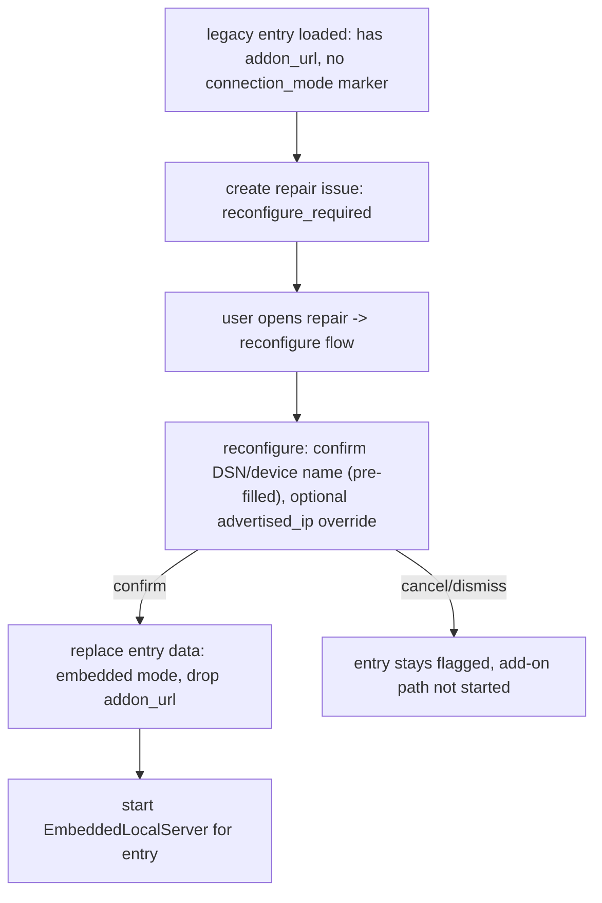

# Contract: `cremalink_ha` Reconfigure Flow (Legacy Add-on Entries)

This documents the user-facing contract for transitioning existing
add-on-based local-mode config entries to the embedded local server,
per the Clarifications in `spec.md` (explicit, user-confirmed switch —
not silent migration).

## Detection (`async_setup_entry`)

- A local-mode config entry is **legacy** if its `entry.data` contains the
  old `CONF_ADDON_URL` key (or otherwise lacks the new embedded-mode
  connection marker described in `data-model.md`).
- Legacy entries do **not** have `async_setup_entry` start an embedded
  server automatically. Instead, a Home Assistant repair issue is raised
  (`issue_registry.async_create_issue`, `is_fixable=True`,
  `translation_key="reconfigure_required"`) identifying the entry.
- New-style (embedded) local entries and cloud entries are unaffected —
  they set up exactly as today.

## `async_step_reconfigure` (new)

- **Pre-filled, read-only display**: DSN, device name, device map (all
  already known from the existing entry — never re-requested).
- **Input schema**: `advertised_ip` (optional str override — FR-013);
  everything else needed (device IP, LAN key) is reused from the existing
  entry data, since those values remain valid regardless of hosting
  mechanism.
- **On submit**: rewrites `entry.data` to the embedded-mode shape (drops
  `CONF_ADDON_URL`, adds the new connection-mode marker), then reloads the
  entry so `async_setup_entry` starts an `EmbeddedLocalServer` for it.
- **On cancel/dismiss**: entry remains in its legacy, flagged state;
  the repair issue stays open (Edge Case: user can revisit any time via
  Settings → Repairs).

## Non-goals

- No option to keep using the add-on going forward is presented — per the
  Clarifications, embedded mode fully replaces the add-on connection path
  for `cremalink_ha`. Users who need the add-on for other reasons (e.g.
  another non-HA consumer) may continue running it independently of
  `cremalink_ha` (Assumptions in spec.md).
- No new manual DSN/LAN-key/IP entry fields are added — those values are
  already present on the legacy entry.
